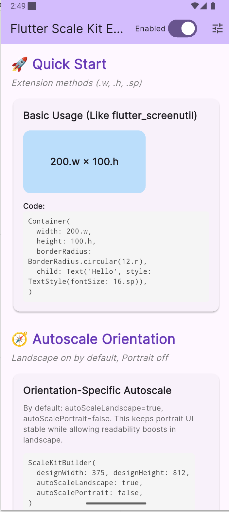
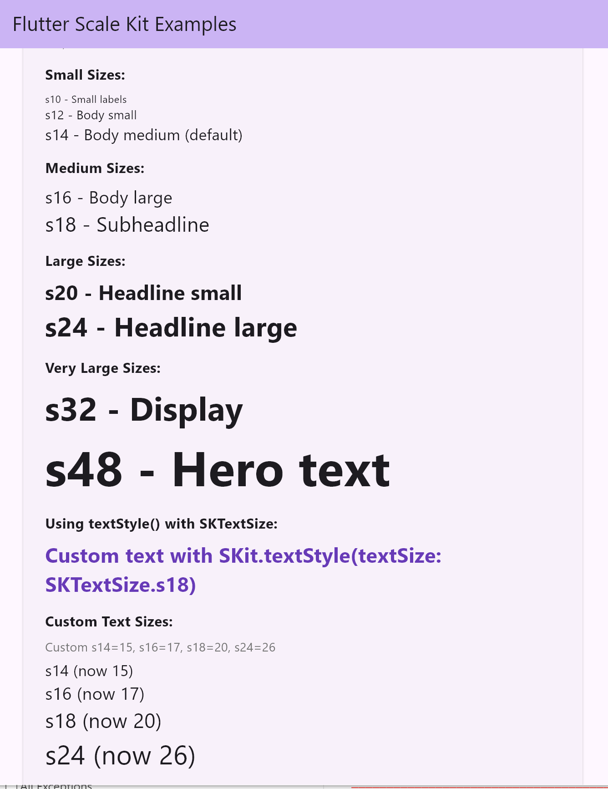
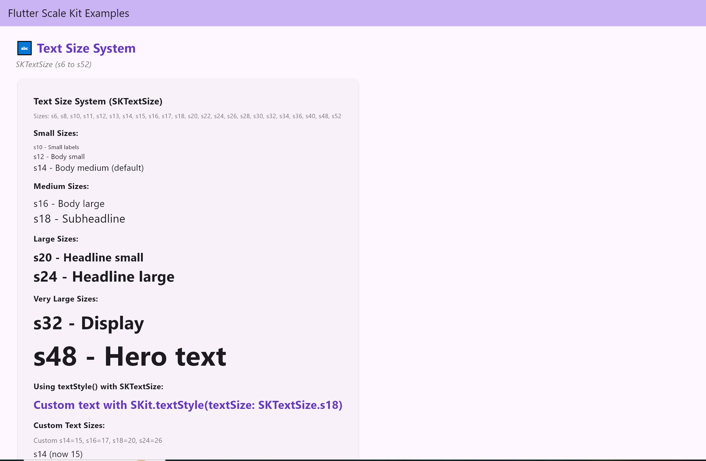
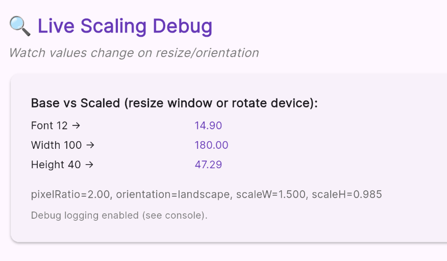
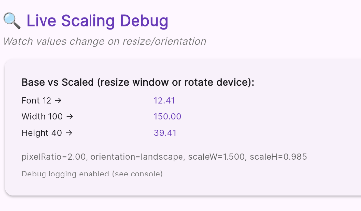
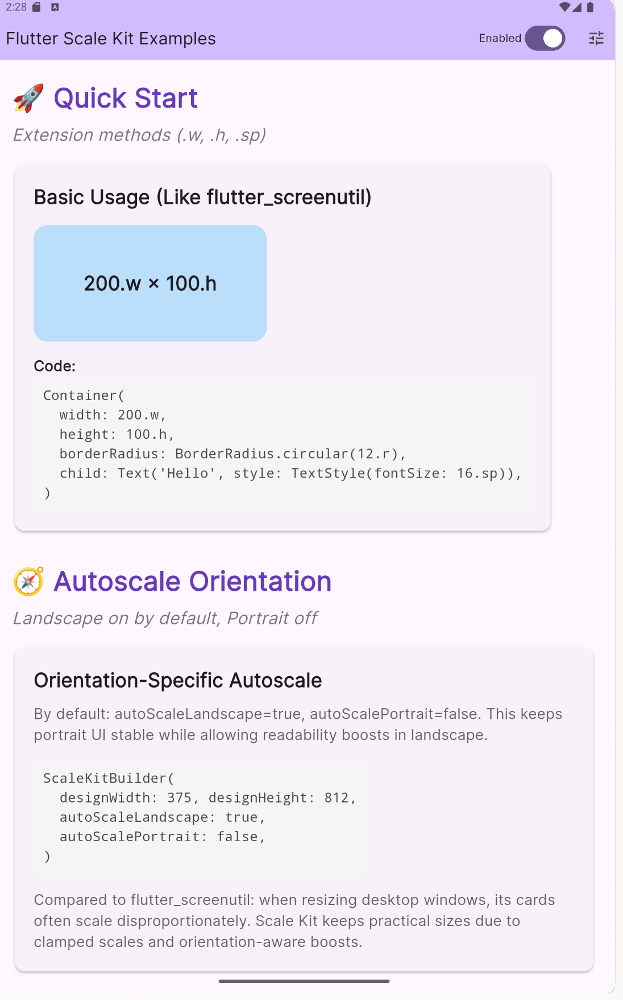
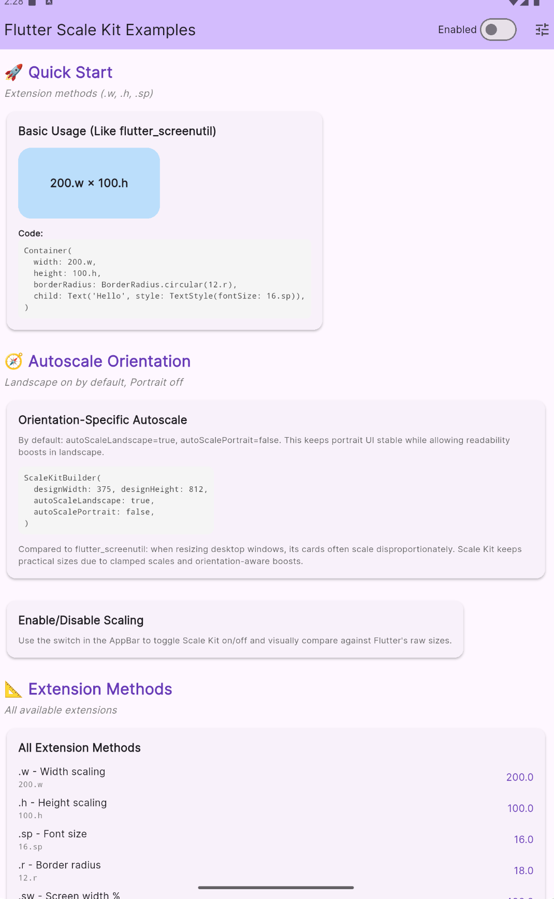

# Flutter Scale Kit

[](https://pub.dev/packages/flutter_scale_kit)
[](https://pub.dev/packages/flutter_scale_kit)
[](https://pub.dev/packages/flutter_scale_kit/score)
[](https://ko-fi.com/fodilfliti)

A high-performance responsive design package for Flutter that helps you create adaptive UIs across different screen sizes with easy-to-use scaling utilities.

<a id="key-features"></a>

## ✨ Key Features

- **🧠 Intelligent Auto-Configuration**: Automatically detects optimal scale limits based on device type, screen size, orientation, and aspect ratio—**works out of the box in 95% of cases**
- **📱 Universal Platform Support**: Handles phones, tablets, desktop, and web with platform-specific optimizations and built-in device detection helpers
- **🔄 Orientation-Aware Scaling**: Adjusts scaling factors on rotation with per-orientation boosts and optional overrides
- **🧩 Full Breakpoint & Behaviour Control**: Tune mobile/tablet/desktop thresholds, choose how desktop mimics other breakpoints, and steer scaling logic without writing custom detectors
- **🎯 Design Fidelity**: Keeps UI proportional to design mockups via size enums (`SKSize`), design tokens, and centralized `ScaleKitDesignValues`
- **⚡ High Performance**: Cached calculations, flyweight factories, and threshold-based updates minimize rebuild overhead
- **🛠️ Developer-Friendly API**: Familiar `.w`, `.h`, `.sp`, `.rSafe` extensions plus `SKit` helpers, responsive builders, and ThemeData integration
- **🔤 Font Intelligence**: Language-aware font configuration with Google Fonts/custom families applied automatically across Text and themes
- **🧪 Runtime Controls & Tooling**: Enable/disable scaling at runtime, integrate with `device_preview`, and compare raw Flutter vs scaled behavior instantly
- **📚 Comprehensive Docs & Examples**: Live web demo, screenshots, and step-by-step guides covering quick start through advanced tuning

> If this package helps you, please click "Like" on the pub.dev page — it improves discoverability and ranking.

> 💝 **Support this project**: If you find Flutter Scale Kit useful, consider [buying me a coffee](https://ko-fi.com/fodilfliti) to help me continue developing and maintaining open-source packages. Your support means a lot! 🙏

---

<a id="demo"></a>

<div align="center">

### 🎯 [**🚀 TRY LIVE DEMO NOW 🚀**](https://fodilfliti.github.io/flutter_scale_kit/)

[](https://fodilfliti.github.io/flutter_scale_kit/)
[](https://fodilfliti.github.io/flutter_scale_kit/)

**👆 Click above to test all features in your browser! 👆**

</div>

---

<a id="table-of-contents"></a>

## 📑 Table of Contents

Jump to any section:

- [📸 Screenshots](#screenshots)

### 🚀 Getting Started

- [🧠 Intelligent Auto-Configuration](#intelligent-auto-configuration)
- [✨ Key Features](#key-features)
- [📦 Installation](#installation)
- [🚀 Getting Started](#quick-start-guide)

### 📚 Complete API Reference

#### 📖 Core Concepts

- [Understanding Scale Limits (minScale & maxScale)](#understanding-scale-limits)
- [Understanding Orientation Boosts (Advanced)](#understanding-orientation-boosts)

#### 🎨 Core APIs

- [Extension Methods (.w, .h, .sp, .rSafe)](#extension-methods)
- [Typography & Theme](#typography-and-theme)
- [Layout & Container Helpers (SKit)](#layout-container-helpers)
- [Spacing Widgets & Const Helpers](#spacing-widgets)

#### 🛠️ Configuration & Advanced

- [Size System Configuration](#size-system-configuration)
- [ScaleKitDesignValues - Centralized Design System](#scalekitdesignvalues)
- [Context Extensions](#context-extensions)

#### ⚙️ Advanced Features

- [ScaleManager Direct API](#scalemanager-direct-api)

### 🧪 Optional Tools

- [Enable/Disable Scaling (Runtime Toggle)](#enable-disable-scaling)
- [Device Preview Integration (Optional)](#device-preview-integration)

### 📚 Reference

- [Performance](#performance)
- [Architecture](#architecture)
- [Advanced Tuning Reference](#advanced-tuning-reference)
- [Device-Specific Scaling](#device-specific-scaling)
- [FAQ](#faq)

### 🤝 Community

- [Contributing](#contributing)
- [Support](#support)
- [License](#license)

---

<a id="screenshots"></a>

## Screenshots

<table style="width:100%;">
  <tr>
    <td align="center" width="40%">
      <strong>Mobile</strong><br/>
      
    </td>
    <td align="center" width="60%">
      <strong>Tablet</strong><br/>
      
    </td>
  </tr>
</table>

### Desktop



### Autoscale and Enable/Disable Examples

<table style="width:100%;">
  <tr>
    <td align="center" width="50%">
      <strong>Autoscale: Enabled</strong><br/>
      
    </td>
    <td align="center" width="50%">
      <strong>Autoscale: Disabled</strong><br/>
      
    </td>
  </tr>
  <tr>
    <td align="center" width="50%">
      <strong>Package Enabled (Scaling On)</strong><br/>
      
    </td>
    <td align="center" width="50%">
      <strong>Package Disabled (Raw Flutter)</strong><br/>
      
    </td>
  </tr>
  <tr>
    <td colspan="2" align="center" style="color:#666; font-size: 12px;">
      Use the settings (tune icon) in the example app to toggle autoscale and package enable/disable, then Save.
    </td>
  </tr>
  
</table>

<a id="intelligent-auto-configuration"></a>

## 🧠 Intelligent Auto-Configuration

**Scale Kit is SMART** — it automatically detects and configures optimal scaling for your app:

<table>
<tr>
<td width="50%" valign="top">

### 📱 **What It Auto-Detects**

✅ **Device Type**

- Mobile phones (iPhone, Android)
- Tablets (iPad, Android tablets)
- Desktop (Windows, macOS, Linux)
- Web browsers (responsive windows)

✅ **Screen Properties**

- Width and height
- Orientation (portrait/landscape)
- Aspect ratio (standard/wide/narrow)
- Pixel density

✅ **Special Cases**

- Foldable devices (Galaxy Fold, etc.)
- Ultra-wide monitors (>2560px)
- Small windows (<800px)
- Notched/tall screens (21:9)

</td>
<td width="50%" valign="top">

### ⚙️ **What It Optimizes**

🎯 **Scale Limits** (automatic)

- Mobile: 0.85-1.15x (portrait), 0.85-1.25x (landscape)
- Tablet: 0.8-1.3x (portrait), 0.75-1.4x (landscape)
- Desktop: 0.6-2.0x (landscape), 0.7-1.8x (portrait)

🔄 **Orientation Boosts**

- Mobile landscape: 1.2x font/size
- Tablet landscape: 1.2x font/size
- Desktop landscape: 1.0x (no boost)
- Portrait: 1.0x (no boost by default)

💡 **Design Adaptation**

- Mobile design → Tablet: increases range
- Mobile design → Desktop: caps upscaling
- Handles resizable windows gracefully

</td>
</tr>
</table>

That’s all—no `minScale`, `maxScale`, or boost knobs required. The limits and boosts you saw above activate automatically so 95% of projects ship with zero manual tuning.

> 💡 **When to tweak manually?** Only when you need tighter compliance (e.g., ±5% variance for brand-critical screens) or a custom scaling feel. Jump to [Understanding Scale Limits](#understanding-scale-limits) for recipes, and follow the [Quick Start Guide](#quick-start-guide) for the full setup flow.

---

<a id="installation"></a>

## Installation

Add this to your package's `pubspec.yaml` file:

```yaml
flutter:
  sdk: flutter

dependencies:
  flutter_scale_kit: ^1.1.7
```

Then run:

```bash
flutter pub get
```

<a id="quick-start-guide"></a>

## 🚀 Getting Started

Flutter Scale Kit provides multiple ways to create responsive UIs. Whether you prefer extension methods like `.w` and `.sp`, helper widgets like `SKit.roundedContainer()`, or comprehensive text styling with `SKit.textFull()`, there's an API that fits your workflow.

All text-related APIs (extensions, `SKit.text*`, responsive themes) automatically apply your `FontConfig` when one is registered—otherwise they fall back to Flutter's default fonts so you can adopt the system gradually.

### Quick Setup (2 minutes)

**Step 1: Configure sizes & fonts (optional but recommended)**

Set up your design system values at app startup:

```dart
void main() {
  // Configure sizes at app startup (before runApp)
  setPaddingSizes(SizeValues.custom(xs: 4, sm: 8, md: 16, lg: 24, xl: 32, xxl: 48));
  setMarginSizes(SizeValues.custom(xs: 2, sm: 4, md: 8, lg: 12, xl: 16, xxl: 24));
  setRadiusSizes(SizeValues.custom(xs: 2, sm: 4, md: 8, lg: 12, xl: 16, xxl: 24));
  setSpacingSizes(SizeValues.custom(xs: 4, sm: 8, md: 12, lg: 16, xl: 20, xxl: 24));
  setTextSizes(TextSizeValues.custom(s14: 15, s16: 17, s18: 20, s24: 26));

  // Set default values for methods without parameters
  setDefaultPadding(16);
  setDefaultMargin(8);
  setDefaultRadius(12);
  setDefaultSpacing(8);
  setDefaultTextSize(14);

  // Optional: apply FontConfig during app bootstrap
  FontConfig.instance
    ..setDefaultFont(googleFont: GoogleFonts.inter)
    ..setLanguageFont(
      const LanguageFontConfig(
        languageCode: 'ja',
        googleFont: GoogleFonts.notoSansJp,
      ),
    )
    ..setLanguageGroupFont(
      const LanguageGroupFontConfig(
        languageCodes: ['ar', 'fa', 'ur'],
        googleFont: GoogleFonts.almarai,
      ),
    );

  // Optionally cache the defaults for reuse (e.g., wrap in your own widget)
  final defaults = SKitValues.defaults(); // returns padding/margin/radius/spacing with current config
  debugPrint('Default padding: ${defaults.padding}');

  runApp(const MyApp());
}
```

**Note:** If you don't configure sizes, default values will be used (xs=2, sm=4, md=8, lg=12, xl=16, xxl=24). FontConfig is optional—see [Typography & Theme](#typography-and-theme) for details.

**Step 2: Wrap your app**

Drop `ScaleKitBuilder` above your root app and pass the design size you targeted in Figma/Sketch:

```dart
import 'package:flutter/material.dart';
import 'package:flutter_scale_kit/flutter_scale_kit.dart';
import 'package:google_fonts/google_fonts.dart'; // Import for FontConfig example

class MyApp extends StatelessWidget {
  const MyApp({super.key});

  @override
  Widget build(BuildContext context) {
    // 👇 Wrap your app so every route inherits responsive scaling
    return ScaleKitBuilder(
      designWidth: 375,
      designHeight: 812,
      designType: DeviceType.mobile,
      // Optional: customize device breakpoints (defaults: 600 / 1200 / 1600 / 1920)
      // breakpoints: const ScaleBreakpoints(
      //   mobileMaxWidth: 640,
      //   tabletMaxWidth: 1180,
      //   desktopMaxWidth: 1680,
      // ),
      // Optional: lock desktop/web platforms to desktop behaviour only
      // lockDesktopPlatforms: true,
      // Optional: pick tablet/mobile variants when locked
      // lockDesktopAsTablet: true,
      // lockDesktopAsMobile: true,
      child: MaterialApp(
        title: 'My App',
        // Optional: create a responsive theme once ScaleKitBuilder is in place
        theme: ResponsiveThemeData.create(
          context: context,
          colorScheme: ColorScheme.fromSeed(seedColor: Colors.deepPurple),
          useMaterial3: true,
        ),
        home: HomePage(),
      ),
    );
  }
}
```

- Need to lock Scale Kit to desktop behaviour (even on smaller windows)? Pass `deviceTypeOverride: DeviceType.desktop` or `DeviceType.web` when constructing `ScaleKitBuilder`.
- Want that lock to happen automatically whenever you’re on web/desktop? Set `lockDesktopPlatforms: true` so Scale Kit forces desktop handling only on those platforms, and use `lockDesktopAsTablet` / `lockDesktopAsMobile` to decide which breakpoint desktop should mimic when locked.

- **Phones** hold between 0.85–1.25×, even on foldables.
- **Tablets** expand comfortably without blowing out typography.
- **Desktop & web** respect tiny windows and ultrawide monitors.

> 📝 **FontConfig & responsive theme are optional:** if you never call `FontConfig` or `ResponsiveThemeData`, everything renders with Flutter's defaults. Configure them later for a complete design system (see [Typography & Theme](#typography-and-theme))—all SKit text helpers and cached styles will pick up your fonts automatically.

Need a different feel? Head to [Understanding Scale Limits](#understanding-scale-limits) for tighter or looser ranges.

### Core APIs - Pick Your Style

Once your app is wrapped with `ScaleKitBuilder`, you can start using Scale Kit in three ways:

#### 1. Extension Methods (Quick & Familiar)

```dart
Container(
  width: 200.w,      // Scaled width
  height: 100.h,     // Scaled height
  padding: EdgeInsets.all(16.w),
  decoration: BoxDecoration(
    borderRadius: BorderRadius.circular(12.rSafe),
  ),
  child: Text(
    'Hello World',
    style: TextStyle(fontSize: 16.sp),  // Scaled font size
  ),
)
```

#### 2. SKit Helper Widgets (Pre-built & Convenient)

```dart
SKit.padding(
  all: 16,
  child: SKit.roundedContainer(
    all: 12,
    color: Colors.blue.shade50,
    borderColor: Colors.blue,
    borderWidth: 2,
    child: Text('Hello'),
  ),
)
```

#### 3. Comprehensive Text Widgets (All-in-One)

```dart
SKit.textFull(
  'Styled Text',
  fontSize: 18,      // Automatically scaled
  fontWeight: FontWeight.bold,
  color: Colors.blue,
  textAlign: TextAlign.center,
  maxLines: 2,
  overflow: TextOverflow.ellipsis,
)
```

**Note:** Most containers need both `borderRadius` and `border`. Use `borderColor` and `borderWidth` parameters to add borders to your rounded containers. All border widths are automatically scaled based on screen size.

### Popular Patterns & Building Blocks

#### Basic Responsive Layout

```dart
ScaleKitBuilder(
  designWidth: 375,
  designHeight: 812,
  child: MaterialApp(
    home: Scaffold(
      body: Padding(
        padding: EdgeInsets.all(20.w),
        child: Text(
          'Welcome!',
          style: TextStyle(fontSize: 20.sp),
        ),
      ),
    ),
  ),
);
```

- Place `ScaleKitBuilder` directly above your `MaterialApp` (or `CupertinoApp`) so every route inherits scaling.
- `.w`, `.h`, and `.sp` keep spacing, components, and fonts proportional to the screen.

#### Responsive Containers & Cards

```dart
SKit.roundedContainer(
  all: 16,
  color: Colors.white,
  padding: EdgeInsets.symmetric(horizontal: 20.w, vertical: 16.h),
  borderColor: Colors.black12,
  borderWidth: 1,
  radiusMode: SKRadiusMode.safe, // uses rSafe clamp internally
  child: Column(
    crossAxisAlignment: CrossAxisAlignment.start,
    children: [
      SKit.text(
        'Dashboard',
        textSize: SKTextSize.s20,
        fontWeight: FontWeight.w600,
      ),
      SizedBox(height: 12.h),
      SKit.text(
        'All metrics auto-scale with the screen.',
        textSize: SKTextSize.s16,
        color: Colors.grey.shade600,
      ),
    ],
  ),
);
```

- One-liners for padding/margin: `SKit.padding(horizontal: 24, vertical: 12)`; use enums for presets (`SKit.paddingSize(horizontal: SKSize.lg)`).
- Containers respect `.rSafe` by default via `SKRadiusMode.safe`, so borders stay natural on large screens.

#### Advanced Layout Switcher

```dart
SKResponsiveBuilder(
  mobile: (_) => _CardsGrid(columns: 1),
  tablet: (_) => _CardsGrid(columns: 2),
  desktop: (_) => _CardsGrid(columns: 4),
  mobileLandscape: (_) => _CardsGrid(columns: 2),
  // Optional: force desktop/web into tablet/mobile breakpoints
  // lockDesktopAsTablet: true,
  // lockDesktopAsMobile: true,
  // deviceTypeOverride: DeviceType.tablet,
);
```

- Supplies dedicated builders per device/orientation and falls back intelligently when one is missing.
- Perfect for dashboards, catalog pages, or any layout that needs different density on phones vs tablets vs desktop.

#### Responsive Int/Double Values

For simple responsive values like grid columns, spacing, or counts, use responsive integers and doubles:

```dart
// Responsive grid columns
final columns = SKit.responsiveInt(
  mobile: 2,           // required base value
  tablet: 4,           // optional - falls back to mobile if null
  desktop: 6,          // optional - falls back to tablet → mobile if null
  mobileLandscape: 3,  // optional override for mobile landscape
  // Optional desktop controls (match builders):
  // deviceTypeOverride: DeviceType.tablet,
  // lockDesktopAsTablet: true,
  // lockDesktopAsMobile: true,
  // desktopAs: DesktopAs.tablet,
);

// Use in GridView
GridView.count(
  crossAxisCount: columns,
  children: [...],
)

// Responsive spacing values
final spacing = SKit.responsiveDouble(
  mobile: 8.0,
  tablet: 16.0,
  desktop: 24.0,
  // Same optional controls as responsiveInt
  // lockDesktopAsMobile: true,
);

// Responsive item counts
final maxItems = SKit.responsiveInt(
  mobile: 10,
  tablet: 20,
  desktop: 50,
);
```

- Define responsive values once and use them throughout your UI
- Automatic fallback: desktop → tablet → mobile
- Works with both integers and doubles
- Advanced options mirror the widget API:
  - `deviceTypeOverride` to force a specific breakpoint
  - `lockDesktopAsTablet` / `lockDesktopAsMobile` to remap desktop/web when the lock is active
  - `desktopAs` to reuse tablet/mobile fallbacks without toggling the lock

#### Design System Tokens

```dart
const design = ScaleKitDesignValues(
  textMd: 16,
  paddingMd: 16,
  radiusMd: 12,
  spacingMd: 16,
);

ScaleKitBuilder(
  designWidth: 375,
  designHeight: 812,
  child: MaterialApp(
    home: Builder(
      builder: (context) {
        final values = design.compute();
        return SKPadding(
          padding: values.paddingMd!,
          child: SKContainer(
            margin: values.marginMd,
            decoration: BoxDecoration(
              borderRadius: values.borderRadiusMd,
            ),
            child: Text('Hello', style: values.textMd),
          ),
        );
      },
    ),
  ),
);
```

- Define tokens once, compute per screen, and reuse responsive values everywhere.
- Works great with const widgets and reduces repetitive size/spacing code.

---

## 📚 Complete API Reference

**🎯 Quick Start Complete!** Above, you learned the essentials: setup, core APIs, and popular patterns.

**📖 Now: Deep Dive** - Below you'll find comprehensive documentation for every method, advanced tuning options, and implementation details. Use this as your complete reference guide.

**You stay in charge:** Scale Kit lets you redefine breakpoints, decide how desktop behaves, and adjust orientation boosts or size-class fallbacks while the engine handles all the wiring—no need for custom detectors or extension glue.

---

## 📖 Core Concepts

<a id="understanding-scale-limits"></a>

#### Understanding Scale Limits (minScale & maxScale)

Scale limits are the guard rails that keep responsive layouts feeling familiar as screens grow or shrink. In nearly every project you can leave them unset and let Scale Kit pick the right range for each device type and orientation.

- **Auto first:** the defaults protect small phones from feeling cramped and keep large monitors from blowing up every pixel.
- **Optional overrides:** add limits only when you need a tighter (or looser) experience than the defaults provide.

```dart
ScaleKitBuilder(
  designWidth: 375,
  designHeight: 812,
  minScale: 0.9, // Optional override
  maxScale: 1.2, // Optional override
  child: MaterialApp(home: HomePage()),
);
```

Need the exact formulas or override recipes? Jump to the [Advanced Tuning Reference](#advanced-tuning-reference).

<a id="understanding-orientation-boosts"></a>

#### Understanding Orientation Boosts (Advanced)

Orientation boosts are gentle multipliers that run **after** scale limits to keep content readable when a device rotates. Smart defaults already cover the common cases, so you only tweak them for specialized layouts.

| Device Type | Portrait | Landscape | Why it matters                            |
| ----------- | -------- | --------- | ----------------------------------------- |
| Mobile      | 1.0×     | 1.2×      | Wider view gets a bit more breathing room |
| Tablet      | 1.0×     | 1.2×      | Big screens gain spacing when horizontal  |
| Desktop     | 1.0×     | 1.0×      | Desktops rarely need extra boosts         |

- Boosts are split for fonts and sizes so text can scale differently from containers.
- System text scaling (`.sp`) is respected on top of these multipliers.

Curious about the math, per-device parameters, or real-world scenarios? See the [Advanced Tuning Reference](#advanced-tuning-reference).

---

<a id="extension-methods"></a>

### Extension Methods (.w, .h, .sp, .rSafe)

All extension methods work similar to `flutter_screenutil`:

```dart
// Width scaling
200.w           // Scaled width

// Height scaling
100.h           // Scaled height

// Font size scaling
16.sp           // Scaled font size

// Border radius scaling
12.r            // Full responsive radius (great for circles/avatars)
12.rSafe        // Stable radius (clamped, default for corners)
12.rFixed       // Constant radius (no scaling)

// Screen percentage
0.5.sw          // 50% of screen width
0.25.sh         // 25% of screen height

// Font size with system factor
16.spf          // Scaled font size with system text scale factor

// Spacing helpers (return SizedBox for gaps)
12.horizontalSpace        // SizedBox(width: 12.w)
16.verticalSpace          // SizedBox(height: 16.h)
```

---

## 🎨 Core APIs

<a id="typography-and-theme"></a>

### Typography & Theme

<a id="comprehensive-text-widgets"></a>

#### Comprehensive Text Widgets

**Problem:** Manually creating Text widgets with all attributes is verbose and repetitive.

**Solution:** Use `SKit.textFull()` and `SKit.textStyleFull()` with **ALL** Flutter Text/TextStyle attributes pre-configured!

> ✅ These helpers respect your `FontConfig` automatically (or default platform fonts when none is configured), so typography stays consistent across languages without extra work.

#### SKit.textFull() - Complete Text Widget

Instead of writing this:

```dart
Text(
  'Hello World',
  style: TextStyle(
    fontSize: 18.sp,
    fontWeight: FontWeight.w600,
    color: Colors.blue,
    letterSpacing: 0.5,
    decoration: TextDecoration.underline,
    shadows: [Shadow(color: Colors.black26, offset: Offset(1, 1))],
  ),
  textAlign: TextAlign.center,
  maxLines: 2,
  overflow: TextOverflow.ellipsis,
  softWrap: true,
  textDirection: TextDirection.ltr,
)
```

Simply write this:

```dart
SKit.textFull(
  'Hello World',
  fontSize: 18,  // Automatically scaled!
  fontWeight: FontWeight.w600,
  color: Colors.blue,
  letterSpacing: 0.5,
  decoration: TextDecoration.underline,
  shadows: [Shadow(color: Colors.black26, offset: Offset(1, 1))],
  textAlign: TextAlign.center,
  maxLines: 2,
  overflow: TextOverflow.ellipsis,
  softWrap: true,
  textDirection: TextDirection.ltr,
)
```

**Available Parameters (30+ attributes):**

- **Style**: fontSize, fontWeight, fontStyle, color, backgroundColor, fontFamily, fontFamilyFallback
- **Spacing**: letterSpacing, wordSpacing, height
- **Decoration**: decoration, decorationColor, decorationStyle, decorationThickness
- **Effects**: shadows, foreground, background
- **Layout**: textAlign, textDirection, textBaseline, leadingDistribution
- **Behavior**: softWrap, overflow, maxLines, textScaler
- **Accessibility**: semanticsLabel, textWidthBasis, textHeightBehavior, selectionColor
- **Advanced**: locale, fontFeatures, fontVariations

#### SKit.textStyleFull() - Complete TextStyle

Create comprehensive TextStyles with all Flutter attributes:

```dart
final headerStyle = SKit.textStyleFull(
  fontSize: 24,
  fontWeight: FontWeight.bold,
  color: Colors.white,
  backgroundColor: Colors.blue,
  letterSpacing: 1.2,
  wordSpacing: 2.0,
  height: 1.5,
  decoration: TextDecoration.none,
  shadows: [
    Shadow(color: Colors.black38, offset: Offset(2, 2), blurRadius: 4),
  ],
  textBaseline: TextBaseline.alphabetic,
  leadingDistribution: TextLeadingDistribution.even,
);

Text('Header', style: headerStyle)
```

**Why use these?**
✅ **All attributes in one place** - no need to remember which parameters go where
✅ **Automatic scaling** - fontSize automatically scaled with `.sp`
✅ **Type-safe** - all Flutter Text/TextStyle parameters available with autocomplete
✅ **Less boilerplate** - write less code, get more functionality
✅ **Consistent styling** - reuse styles easily across your app

**When to use:**

- Use `SKit.text()` for simple text (basic styling)
- Use `SKit.textFull()` when you need advanced Text widget features
- Use `SKit.textStyleFull()` when you need reusable comprehensive styles

<a id="themedata-integration"></a>

#### ThemeData Integration

Use responsive scaling in your theme:

```dart
ScaleKitBuilder(
  designWidth: 375,
  designHeight: 812,
  designType: DeviceType.mobile,
  child: MaterialApp(
    theme: ResponsiveThemeData.create(
      context: context,
      colorScheme: ColorScheme.fromSeed(seedColor: Colors.deepPurple),
      useMaterial3: true,
    ),
    home: HomePage(),
  ),
)
```

<a id="font-configuration"></a>

#### Font Configuration (Automatic Font Selection)

Configure fonts for different languages. All TextStyles automatically use the configured font for the current language:

```dart
import 'package:google_fonts/google_fonts.dart';

void main() {
  // Configure font for specific language (optional)
  // If not configured, Flutter's default font will be used
  FontConfig.instance.setLanguageFont(
    LanguageFontConfig(
      languageCode: 'ar',
      googleFont: GoogleFonts.almarai,  // Pass GoogleFonts function
    ),
  );

  FontConfig.instance.setLanguageFont(
    LanguageFontConfig(
      languageCode: 'en',
      googleFont: GoogleFonts.inter,
    ),
  );

  // Configure font for language group
  FontConfig.instance.setLanguageGroupFont(
    LanguageGroupFontConfig(
      languageCodes: ['ar', 'fa', 'ur'],
      googleFont: GoogleFonts.almarai,
    ),
  );

  // Set default font (used when no specific language config exists)
  FontConfig.instance.setDefaultFont(
    googleFont: GoogleFonts.inter,
  );

  runApp(const MyApp());
}
```

**Usage:**

Once configured, all TextStyles automatically use the configured font:

```dart
// Automatic font application - no manual configuration needed
Text('Hello', style: TextStyle(fontSize: 16.sp))  // ✅ Uses FontConfig automatically

// Or via theme - all theme text styles get the font automatically
ResponsiveThemeData.create(
  context: context,
  colorScheme: ColorScheme.fromSeed(seedColor: Colors.deepPurple),
  useMaterial3: true,
)
```

---

<a id="layout-container-helpers"></a>

### Layout & Container Helpers (SKit)

The `SKit` class provides convenient methods for creating widgets:

```dart
// Padding
SKit.padding(all: 16, child: widget)
SKit.paddingSize(all: SKSize.md, child: widget)
final insets = SKit.paddingEdgeInsets(all: 16); // Scaled EdgeInsets

// Margin
SKit.margin(12, child: widget)
SKit.marginSize(all: SKSize.md, child: widget)
final marginInsets = SKit.marginEdgeInsetsSize(all: SKSize.md);

// Rounded container with border on all sides
SKit.roundedContainer(
  all: 12,
  color: Colors.blue.shade50,
  borderColor: Colors.blue,
  borderWidth: 2,
)

// Lock the radius to design value (no scaling)
SKit.roundedContainer(
  all: 12,
  radiusMode: SKRadiusMode.fixed,
  color: Colors.orange.shade50,
)

// Force fully responsive radius (useful for pills/avatars)
SKit.roundedContainer(
  all: 50,
  radiusMode: SKRadiusMode.scaled,
  color: Colors.purple.shade50,
)

> By default, all `SKit.rounded*` helpers use `SKRadiusMode.safe`, which gently clamps the radius to keep corners natural on large displays.

// Rounded container with border on specific sides
SKit.roundedContainer(
  all: 12,
  color: Colors.green.shade50,
  borderTop: true,
  borderBottom: true,
  borderColor: Colors.green,
  borderWidth: 2,
)

// Rounded container with different colors per side
SKit.roundedContainer(
  all: 12,
  color: Colors.pink.shade50,
  borderTop: true,
  borderTopColor: Colors.red,
  borderTopWidth: 3,
  borderBottom: true,
  borderBottomColor: Colors.blue,
  borderBottomWidth: 2,
)

// Rounded container with gradient, elevation, and image overlay
SKit.roundedContainer(
  all: 16,
  gradient: const LinearGradient(
    colors: [Color(0xFF7F7FD5), Color(0xFF86A8E7), Color(0xFF91EAE4)],
  ),
  elevation: 8,
  shadowColor: Colors.black54,
  backgroundImage: const DecorationImage(
    image: AssetImage('assets/images/rounded_bg.png'),
    fit: BoxFit.cover,
    colorFilter: ColorFilter.mode(Colors.black26, BlendMode.darken),
  ),
  padding: EdgeInsets.all(20),
  child: Text(
    'Gradient + shadow + background image',
    style: TextStyle(color: Colors.white),
  ),
)

SKit.roundedContainerSize(
  all: SKSize.md,
  color: Colors.blue.shade50,
  borderColor: Colors.blue,
  borderWidth: 2,
)

// Fetch scaled EdgeInsets directly (great for custom widgets/layouts)
final padding = SKit.paddingEdgeInsetsSize(horizontal: SKSize.md, vertical: SKSize.sm);
final rawPadding = SKit.paddingEdgeInsets(all: 12); // accepts doubles when you skip enums

// Spacing
SKit.hSpace(8)           // Horizontal spacing
SKit.vSpace(8)           // Vertical spacing
SKit.sSpace(8)           // Square spacing
```

<a id="spacing-widgets"></a>

### Spacing Widgets & Const Helpers

Enjoy fluent numeric spacing like `20.horizontalSpace` alongside dedicated const widgets when you need absolute control.

**Const-friendly widgets**

- `SKSizedBox({width, height})` — thin wrapper around `SizedBox` for const usage with precomputed values
- `HSpace(double width)` — horizontal gap
- `VSpace(double height)` — vertical gap
- `SSpace(double size)` — square gap in both axes

**Numeric extensions (scaled automatically)**

- `12.horizontalSpace` → `HSpace(12.w)`
- `16.verticalSpace` → `VSpace(16.h)`

These helpers are cached by the same `ScaleValueFactory` used by `.w`/`.h`, so they stay fast even when reused inside lists.

```dart
Row(
  children: [
    Container(width: 32.w, height: 32.w, color: Colors.purple),
    12.horizontalSpace,
    Container(width: 32.w, height: 32.w, color: Colors.green),
    20.horizontalSpace,
    Container(width: 32.w, height: 32.w, color: Colors.orange),
  ],
);

Column(
  crossAxisAlignment: CrossAxisAlignment.start,
  children: [
    Container(height: 12.h, color: Colors.blue),
    12.verticalSpace,
    Container(height: 12.h, color: Colors.pink),
    16.verticalSpace,
    Container(height: 12.h, color: Colors.teal),
  ],
);
```

### Optimized Layout Widgets (`SKPadding`, `SKMargin`, `SKContainer`)

Minimize rebuild work with lightweight wrappers while keeping everything scaled:

```dart
SKPadding(
  padding: EdgeInsets.all(16.w),
  child: SKMargin(
    margin: EdgeInsets.only(bottom: 12.h),
    child: SKContainer(
      padding: EdgeInsets.symmetric(horizontal: 12.w, vertical: 10.h),
      decoration: BoxDecoration(
        color: Colors.blue.shade50,
        borderRadius: BorderRadius.circular(12.rSafe),
      ),
      child: Text(
        'Scaled padding, margin, and container in one line',
        style: TextStyle(fontSize: 14.sp),
      ),
    ),
  ),
);
```

---

## 🛠️ Configuration & Advanced

### Size System Configuration

**Important:** Configure your size values at the start of your app (typically in `main()` or app initialization) before using size enums. This ensures consistent sizing throughout your application.

#### Where to Configure

Set up your size configurations in your app's initialization:

```dart
void main() {
  // Configure sizes at app startup (before runApp)
  setPaddingSizes(SizeValues.custom(xs: 4, sm: 8, md: 16, lg: 24, xl: 32, xxl: 48));
  setMarginSizes(SizeValues.custom(xs: 2, sm: 4, md: 8, lg: 12, xl: 16, xxl: 24));
  setRadiusSizes(SizeValues.custom(xs: 2, sm: 4, md: 8, lg: 12, xl: 16, xxl: 24));
  setSpacingSizes(SizeValues.custom(xs: 4, sm: 8, md: 12, lg: 16, xl: 20, xxl: 24));
  setTextSizes(TextSizeValues.custom(s14: 15, s16: 17, s18: 20, s24: 26));

  // Set default values for methods without parameters
  setDefaultPadding(16);
  setDefaultMargin(8);
  setDefaultRadius(12);
  setDefaultSpacing(8);
  setDefaultTextSize(14);

  runApp(const MyApp());
}
```

#### Using Size Enums

After configuration, use size enums throughout your app:

```dart
// Padding with size enum
SKit.paddingSize(all: SKSize.md, child: widget)
SKit.paddingSize(horizontal: SKSize.lg, vertical: SKSize.sm, child: widget)

// Margin with size enum
SKit.marginSize(all: SKSize.md, child: widget)

// Radius with size enum
SKit.roundedContainerSize(all: SKSize.lg, color: Colors.blue)

// Spacing with size enum
SKit.hSpaceSize(SKSize.md)  // Horizontal spacing
SKit.vSpaceSize(SKSize.sm)  // Vertical spacing
```

#### Using Default Values

When you've set default values, you can use methods without parameters:

```dart
SKit.pad()              // Uses default padding (16)
SKit.margin()           // Uses default margin (8)
SKit.rounded()         // Uses default safe radius (12)
SKit.h()                // Uses default spacing (8)
SKit.v()                // Uses default spacing (8)
```

#### Rounded Container with Border

Most containers need both border radius and border. Use `borderColor` and `borderWidth` parameters:

```dart
// Container with radius and border on all sides
SKit.roundedContainer(
  all: 12,
  color: Colors.blue.shade50,
  borderColor: Colors.blue,
  borderWidth: 2,  // Border thickness (automatically scaled)
  child: Text('Content'),
)

// Border on specific sides only
SKit.roundedContainer(
  all: 12,
  color: Colors.green.shade50,
  borderTop: true,      // Border on top
  borderBottom: true,    // Border on bottom
  borderColor: Colors.green,
  borderWidth: 2,
  child: Text('Content'),
)

// Different colors and widths for different sides
SKit.roundedContainer(
  all: 12,
  color: Colors.pink.shade50,
  borderTop: true,
  borderTopColor: Colors.red,
  borderTopWidth: 3,
  borderBottom: true,
  borderBottomColor: Colors.blue,
  borderBottomWidth: 2,
  borderLeft: true,
  borderLeftColor: Colors.green,
  borderLeftWidth: 1,
  child: Text('Content'),
)

// Using size enum
SKit.roundedContainerSize(
  all: SKSize.md,
  color: Colors.blue.shade50,
  borderColor: Colors.blue,
  borderWidth: 2,
  child: Text('Content'),
)

// Using default radius with border
SKit.rounded(
  null,
  const Text('Content'),
  Colors.blue.shade50,
  Colors.blue,  // borderColor
  2,            // borderWidth
)
```

**Border Parameters:**

- `borderColor` - Border color for all sides (if individual sides not specified)
- `borderWidth` - Border width for all sides (automatically scaled)
- `borderTop`, `borderBottom`, `borderLeft`, `borderRight` - Show border on specific sides (boolean)
- `borderTopColor`, `borderBottomColor`, `borderLeftColor`, `borderRightColor` - Individual side colors
- `borderTopWidth`, `borderBottomWidth`, `borderLeftWidth`, `borderRightWidth` - Individual side widths (automatically scaled)

<a id="scalekitdesignvalues"></a>

### ScaleKitDesignValues - Centralized Design System

Define your design tokens once, compute everywhere:

```dart
// 1. Define your design system (can be const)
const design = ScaleKitDesignValues(
  textSm: 12, textMd: 14, textLg: 16,
  paddingSm: 8, paddingMd: 16, paddingLg: 24,
  spacingSm: 8, spacingMd: 16, spacingLg: 24,
  radiusSm: 6, radiusMd: 12, radiusLg: 16,
);

// 2. Compute once per build/screen
final values = design.compute();

// 3. Use everywhere - all values auto-scaled
SKPadding(
  padding: values.paddingMd!,
  child: SKContainer(
    decoration: BoxDecoration(
      color: Colors.white,
      borderRadius: values.borderRadiusMd,
    ),
    child: Text('Hello', style: values.textMd),
  ),
)
```

**Why ScaleKitDesignValues?**

- **Performance**: One computation for all design tokens
- **Consistency**: Centralized design system with automatic scaling
- **Clean code**: No scattered size/spacing values throughout your app
- **Type-safe**: Compile-time verification of design tokens

**Pattern**: Define once → Compute once → Use everywhere

**Pro tip**: For simple cases, use `SKitValues.compute(padding: 16, margin: 8, borderRadius: 12)` instead.

```dart
// Define your design tokens once (can be const)
const design = ScaleKitDesignValues(
  textSm: 12,
  textMd: 14,
  textLg: 16,
  paddingSm: 8,
  paddingMd: 16,
  paddingLg: 24,
  spacingSm: 8,
  spacingMd: 16,
  spacingLg: 24,
  radiusSm: 6,
  radiusMd: 12,
);

@override
Widget build(BuildContext context) {
  // Compute once per build
  final values = design.compute();

  return ListView.separated(
    padding: values.paddingHorizontal,
    itemCount: 20,
    separatorBuilder: (_, __) => SizedBox(height: values.spacingMd!),
    itemBuilder: (context, index) {
      return SKContainer(
        margin: values.marginHorizontal,
        decoration: BoxDecoration(
          color: Colors.white,
          borderRadius: values.borderRadiusMd,
        ),
        padding: values.paddingMd,
        child: Row(
          children: [
            Container(
              width: values.widthSm ?? 40,
              height: values.heightSm ?? 40,
              decoration: BoxDecoration(
                color: Colors.blue.shade50,
                borderRadius: values.borderRadiusSm,
              ),
            ),
            SizedBox(width: values.spacingMd!),
            Expanded(
              child: Column(
                crossAxisAlignment: CrossAxisAlignment.start,
                children: [
                  Text('Title', style: values.textLg?.copyWith(fontWeight: FontWeight.bold)),
                  SizedBox(height: values.spacingSm!),
                  Text('Subtitle text', style: values.textSm),
                ],
              ),
            ),
          ],
        ),
      );
    },
  );
}
```

Legacy compute helper (simple one-off values)

If you only need a few values in places where defining a full theme is overkill, you can use the legacy `SKitValues.compute` factory. This is maintained for convenience but `ScaleKitDesignValues.compute()` is recommended for larger UIs.

```dart
final v = SKitValues.compute(
  padding: 16,
  margin: 8,
  borderRadius: 12,
  width: 120,
  height: 48,
  fontSize: 16,
);

return SKPadding(
  padding: v.padding,
  child: SKContainer(
    margin: v.margin,
    decoration: BoxDecoration(borderRadius: v.borderRadius),
    width: v.width,
    height: v.height,
    child: Text('Button', style: TextStyle(fontSize: v.fontSize)),
  ),
);
```

<a id="context-extensions"></a>

### Context Extensions

Use context extensions for responsive scaling:

```dart
Container(
  padding: context.scalePadding(horizontal: 20, vertical: 16),
  margin: context.scaleMargin(all: 8),
  decoration: BoxDecoration(
    borderRadius: context.scaleBorderRadius(all: 12),
  ),
  child: const Text('Content'),
)

// Device detection
if (context.isMobile) {
  // Mobile layout
} else if (context.isTablet) {
  // Tablet layout
}
```

<a id="scalemanager-direct-api"></a>

### ScaleManager Direct API

Access scale values directly:

```dart
final scale = ScaleManager.instance;

Container(
  width: scale.getWidth(200),
  height: scale.getHeight(100),
  decoration: BoxDecoration(
    borderRadius: BorderRadius.circular(scale.getRadius(12)),
  ),
  child: Text(
    'Hello',
    style: TextStyle(fontSize: scale.getFontSize(16)),
  ),
)
```

### Helper Properties

Access device properties similar to `flutter_screenutil`:

```dart
final scaleKit = ScaleManager.instance;

// Device properties
double screenWidth = scaleKit.screenWidth;
double screenHeight = scaleKit.screenHeight;
double pixelRatio = scaleKit.pixelRatio;
double statusBarHeight = scaleKit.statusBarHeight;
double bottomBarHeight = scaleKit.bottomBarHeight;
double textScaleFactor = scaleKit.textScaleFactor;
double scaleWidth = scaleKit.scaleWidth;
double scaleHeight = scaleKit.scaleHeight;
Orientation orientation = scaleKit.orientation;
DeviceType deviceType = scaleKit.deviceType;
PlatformCategory platform = scaleKit.platformCategory;
DeviceSizeClass sizeClass = scaleKit.screenSizeClass;
```

- `deviceType` respects `deviceTypeOverride` and `lockDesktopPlatforms`.
- `platformCategory` safely reports the underlying platform without using `dart:io`, so it works on web too.
- `deviceTypeFor(DeviceClassificationSource source)` exposes the responsive, platform, or size classifications so you can sync with the new context helpers or custom logic.
- `desktopLockFallback` tells you which breakpoint desktop/web will mimic when the lock is active (configurable globally or per widget).
- `screenSizeClass` reflects the current `DeviceSizeClass` helper (small mobile → extra large desktop) derived from your configured breakpoints.

### Custom Breakpoints & Size Classes

Tweak the width thresholds used for device detection (and the derived size
classes) by supplying `ScaleBreakpoints` to `ScaleKitBuilder`:

```dart
const customBreakpoints = ScaleBreakpoints(
  mobileMaxWidth: 540,
  tabletMaxWidth: 1100,
  desktopMaxWidth: 1650,
  largeDesktopMaxWidth: 2200,
);

return ScaleKitBuilder(
  breakpoints: customBreakpoints,
  designWidth: 375,
  designHeight: 812,
  child: MaterialApp(...),
);
```

`ScaleManager.screenSizeClass` and the new context helpers (see below) let you
branch on the expanded `DeviceSizeClass` enum—ranging from `smallMobile` all the
way up to `extraLargeDesktop`.

<a id="responsive-builder-columns"></a>

### Responsive Builder & Columns

Build different widgets per device/orientation with sensible fallbacks, and resolve responsive integers (e.g., Grid columns) quickly.

#### SKResponsive Widget

Use when you have separate builders for each device/orientation:

```dart
// Widget builder with separate builders
SKResponsive(
  mobile: (_) => Text('Mobile portrait'),
  mobileLandscape: (_) => Text('Mobile landscape'), // Falls back to mobile if null
  tablet: (_) => Text('Tablet portrait'),
  tabletLandscape: (_) => Text('Tablet landscape'), // Falls back to tablet -> mobileLandscape -> mobile
  desktop: (_) => Text('Desktop'),
  // Optional: force a device type (e.g., keep desktop UI on web regardless of width)
  deviceTypeOverride: DeviceType.desktop,
  // Optional: when desktop lock is active, force tablet/mobile branches
  lockDesktopAsTablet: true,
)
```

Fallback rules:

- `mobileLandscape` → falls back to `mobile` if null
- `tabletLandscape` → falls back to `tablet` → `mobileLandscape` → `mobile` if null
- Device: desktop → tablet → mobile; tablet → mobile

#### SKResponsiveBuilder Widget

Supports two usage patterns:

**Pattern 1: Builder with device/orientation info**
Use when you need access to device and orientation in your builder function:

```dart
SKResponsiveBuilder(
  builder: (context, device, orientation) {
    if (device == DeviceType.mobile && orientation == Orientation.landscape) {
      return Text('Mobile Landscape');
    }
    if (device == DeviceType.tablet) {
      return Text('Tablet');
    }
    return Text('Desktop or other');
  },
  desktopAs: DesktopAs.tablet, // Optional: make desktop behave like tablet
  // Optional: force a specific device classification for this builder
  deviceTypeOverride: DeviceType.desktop,
  // Optional: push locked desktop to mobile/tablet branches
  lockDesktopAsMobile: true,
)
```

**Pattern 2: Separate builders (like SKResponsive)**
Use when you prefer separate builders for each device/orientation:

```dart
SKResponsiveBuilder(
  mobile: (_) => Text('Mobile'),
  tablet: (_) => Text('Tablet'),
  desktop: (_) => Text('Desktop'),
  mobileLandscape: (_) => Text('Mobile Landscape'), // Falls back to mobile if null
  tabletLandscape: (_) => Text('Tablet Landscape'), // Falls back to tablet -> mobileLandscape -> mobile
)
```

**Priority**: If both patterns are provided, device-specific builders take priority over the main builder.

```dart
// Responsive integer with fallback rules (alias for columns)
final cols = SKit.responsiveInt(
  mobile: 2, // required base
  tablet: 4, // optional (falls back to mobile if null)
  desktop: 8, // optional (falls back to tablet->mobile if null)
  mobileLandscape: 4, // optional override for mobile landscape
  // tabletLandscape falls back to mobileLandscape, then tablet, then mobile
);
GridView.count(crossAxisCount: cols)
```

Both widgets support the same fallback rules:

- Device: desktop → tablet → mobile; tablet → mobile
- Orientation: landscape → device portrait; for tablet.landscape → mobile.landscape → mobile.portrait
- Desktop remapping: control it globally with `ScaleKitBuilder` (`lockDesktopPlatforms`, `lockDesktopAsTablet`, `lockDesktopAsMobile`) or per widget/value via the same flags. Use `deviceTypeOverride` to bypass detection entirely when you need a hard switch.
- Remapping respects live window size: e.g. `lockDesktopAsMobile` only routes desktop/web to the mobile branch when the window width falls under the mobile breakpoint; wider windows continue to render the desktop builder.

Desktop behavior (CSS-like):

- On Android/iOS, devices are classified only as mobile or tablet by width; desktop logic doesn't apply.
- On desktop (width ≥ 1200), desktop values are used by default. You can opt to reuse tablet/mobile values to mimic CSS breakpoints.
- This lets you build grids like in CSS (e.g., 2/4/8 columns) while forcing desktop to act like tablet/mobile if that's desired.

Examples:

```dart
// Make desktop behave like tablet for layout decisions
SKResponsive(
  mobile: (_) => MobileView(),
  tablet: (_) => TabletView(),
  desktop: (_) => DesktopView(),
  desktopAs: DesktopAs.tablet, // 👈 map desktop to tablet behavior
)

// Resolve an integer (e.g., Grid crossAxisCount) with desktop mapped to tablet
final cols = SKit.responsiveInt(
  mobile: 2,
  tablet: 4,
  desktop: 8,
  desktopAs: DesktopAs.tablet, // 👈 desktop will use tablet values unless explicitly provided
);
GridView.count(crossAxisCount: cols)
```

<a id="orientation-autoscale"></a>

### Orientation Autoscale (Landscape vs Portrait)

Scale Kit lets you control autoscale behavior per orientation. Defaults are tuned for comfort: landscape boosts are enabled, portrait boosts are disabled.

```dart
ScaleKitBuilder(
  designWidth: 375,
  designHeight: 812,
  // Orientation-specific flags
  autoScaleLandscape: true,  // default
  autoScalePortrait: false,  // default
  // Optional landscape boosts
  mobileLandscapeFontBoost: 1.2,
  mobileLandscapeSizeBoost: 1.2,
)
```

Notes:

- Landscape: readability boosts (e.g., +20% fonts on mobile) can apply.
- Portrait: stable sizes by default; set `autoScalePortrait: true` if you want portrait boosts.
- Size boosts only apply in landscape by default; portrait preserves your design intent.

## API Reference

### Extension Methods (on num)

- `.w` - Scaled width (e.g., `200.w`)
- `.sw` - Screen width percentage (e.g., `0.5.sw` = 50% width)
- `.sh` - Screen height percentage (e.g., `0.25.sh` = 25% height)
- `.rSafe` - Stable radius with gentle clamping (e.g., `12.rSafe`)
- `.r` - Fully responsive radius/border radius (e.g., `12.r`)
- `.rFixed` - Constant radius (no scaling, e.g., `12.rFixed`)
- `.sp` - Scaled font size (e.g., `16.sp`)
- `.h` - Scaled height (e.g., `100.h`)
- `.spf` - Font size with system text scale factor (e.g., `16.spf`)

### Context Extensions

- `context.scaleWidth(double width)` - Get scaled width
- `context.scaleHeight(double height)` - Get scaled height
- `context.scaleFontSize(double fontSize)` - Get scaled font size
- `context.scaleSize(double size)` - Get scaled size
- `context.scalePadding(...)` - Get responsive padding
- `context.scaleMargin(...)` - Get responsive margin
- `context.scaleBorderRadius(...)` - Get responsive border radius
- `context.isMobile` - Check if device is mobile
- `context.isTablet` - Check if device is tablet
- `context.isDesktop` - Check if device is desktop
- `context.isTypeOfMobile({source: DeviceClassificationSource.responsive})` - Check mobile classification across responsive/platform/size sources
- `context.isTypeOfTablet({source: DeviceClassificationSource.responsive})` - Check tablet classification across responsive/platform/size sources
- `context.isTypeOfDesktop({source: DeviceClassificationSource.responsive, includeWeb: true})` - Check desktop classification, optionally treating web as desktop
- `context.isDesktopPlatform` - True when running on Windows/macOS/Linux/Web
- `context.isWebPlatform` - True when running on the web
- `DeviceClassificationSource` lets you target the responsive result (default), the raw platform classification, or width-only size classification when using the helpers above.
- `context.screenSizeClass` - Retrieve the current `DeviceSizeClass`
- `context.isSmallMobileSize` / `isMobileSize` / `isLargeMobileSize` / `isTabletSize` / `isLargeTabletSize` / `isDesktopSize` / `isLargeDesktopSize` / `isExtraLargeDesktopSize` - Convenience checks for the expanded size classes
- `context.isDesktopMobileSize` / `isDesktopTabletSize` / `isDesktopDesktopOrLarger` - Desktop/web-only size flags combining platform + size class
- `context.isDesktopAtLeastTablet` / `isDesktopAtLeastDesktop` - Desktop/web-only min-width helpers (use previous breakpoint thresholds, CSS-style `min-width`)
- `context.scaleBreakpoints` - Access the active breakpoint configuration

### DeviceType Helpers

- `deviceType.isTypeOfMobile` / `.isTypeOfTablet` / `.isTypeOfDesktop` / `.isTypeOfWeb` expose simple checks on the enum itself.

### ScaleManager Properties

- `pixelRatio` - Device pixel density
- `screenWidth` - Device width in logical pixels
- `screenHeight` - Device height in logical pixels
- `bottomBarHeight` - Bottom safe zone distance
- `statusBarHeight` - Status bar height (includes notch)
- `textScaleFactor` - System font scaling factor
- `scaleWidth` - Ratio of actual width to UI design width
- `scaleHeight` - Ratio of actual height to UI design height
- `orientation` - Screen orientation (portrait/landscape)
- `devicePixelRatio` - Physical pixels per logical pixel
- `topSafeHeight` - Top safe area height
- `bottomSafeHeight` - Bottom safe area height
- `safeAreaHeight` - Total safe area height
- `safeAreaWidth` - Safe area width

### ScaleManager Methods

- `getWidth(double width)` - Get scaled width
- `getHeight(double height)` - Get scaled height
- `getFontSize(double fontSize)` - Get scaled font size
- `getFontSizeWithFactor(double fontSize)` - Get scaled font size with system factor
- `getRadius(double radius)` - Get scaled radius
- `getScreenWidth(double percentage)` - Get screen width percentage
- `getScreenHeight(double percentage)` - Get screen height percentage

### FontConfig API

- `FontConfig.instance` - Singleton instance for font configuration
- `setLanguageFont(LanguageFontConfig)` - Configure font for specific language
- `setLanguageGroupFont(LanguageGroupFontConfig)` - Configure font for language group
- `setDefaultFont({googleFont?, customFontFamily?})` - Set default font
- `setLanguagesFonts(List<LanguageFontConfig>)` - Configure multiple languages at once
- `setLanguageGroupsFonts(List<LanguageGroupFontConfig>)` - Configure multiple language groups
- `getTextStyle({languageCode?, baseTextStyle})` - Get TextStyle with configured font
- `currentLanguageCode` - Get current language code
- `clear()` - Clear all font configurations

## Performance

Flutter Scale Kit uses intelligent caching to minimize recalculations:

- **Flyweight Pattern**: Reuses cached calculated values
- **Cache Invalidation**: Automatically clears cache on size/orientation change
- **Const Widgets**: Pre-calculated values for const-compatible widgets
- **Singleton Pattern**: Single instance manages all scaling operations
- **Threshold-Based Updates**: Only recalculates on significant size changes (>5%)

## Architecture

The package uses design patterns for optimal performance:

- **Singleton**: `ScaleManager` - Global scale configuration
- **Factory**: `ScaleValueFactory` - Creates cached scaled values
- **Flyweight**: `ScaleValueCache` - Reuses cached values

<a id="advanced-tuning-reference"></a>

## 🛠️ Advanced Tuning Reference

Ready to go beyond the defaults? These notes expand on the core concepts above so you always know what will happen before you flip a switch.

### Manual Scale Limit Overrides

Scale limits clamp the raw width/height ratios that Flutter Scale Kit calculates:

- `scaleWidth = screenWidth / designWidth`
- `scaleHeight = screenHeight / designHeight`
- `finalScaleWidth = clamp(scaleWidth, minScale, maxScale)`
- `finalScaleHeight = clamp(scaleHeight, minScale, maxScale)`

**Real-world example**

Design: `375×812` (iPhone 13 mini) → Displayed on an iPad Pro portrait (`1024×1366`)

```
Without limits:
  scaleWidth = 1024 / 375 = 2.73x  →  100px button → 273px (too huge)
  scaleHeight = 1366 / 812 = 1.68x

With minScale: 0.8, maxScale: 1.2:
  clampedWidth = clamp(2.73, 0.8, 1.2) = 1.2x  →  100px button → 120px ✓
  clampedHeight = clamp(1.68, 0.8, 1.2) = 1.2x
```

**Override recipes**

| Use Case            | minScale | maxScale | Why                                         |
| ------------------- | -------- | -------- | ------------------------------------------- |
| Strict design match | `0.95`   | `1.05`   | Keeps UI locked to spec (brand/compliance)  |
| Extra accessibility | `0.6`    | `2.0`    | Lets system text scaling dominate           |
| Locked tablet range | `0.9`    | `1.2`    | Makes tablets feel like big phones          |
| Desktop max limit   | `0.7`    | `1.3`    | Caps desktop scaling to avoid giant widgets |

**Quick check**

```dart
// Design: 375×812, Screen: 1024×1366, maxScale: 1.2
200.w; // 200 × 1.2 = 240  (instead of 546 without clamping)
16.sp; // 16 × 1.2 × orientationBoost × systemTextScale
```

**Pro tip:** Start with `minScale ≈ 0.9` and `maxScale ≈ 1.4` if you just want a gentle clamp for tablets while keeping phones untouched.

### Orientation Boost Deep Dive

Orientation boosts multiply **after** clamping to adapt layouts when a device rotates:

```
finalSize      = designValue × clampedScale × orientationSizeBoost
finalFontSize  = designFontSize × clampedScale × orientationFontBoost × systemTextScale
```

**Smart defaults**

| Device Type | Orientation | Font Boost | Size Boost | Why                            |
| ----------- | ----------- | ---------- | ---------- | ------------------------------ |
| Mobile      | Portrait    | 1.0×       | 1.0×       | Baseline                       |
| Mobile      | Landscape   | 1.2×       | 1.2×       | Landscape needs breathing room |
| Tablet      | Portrait    | 1.0×       | 1.0×       | Already spacious               |
| Tablet      | Landscape   | 1.2×       | 1.2×       | Horizontal layouts feel airy   |
| Desktop     | Portrait    | 1.0×       | 1.0×       | Rare use                       |
| Desktop     | Landscape   | 1.0×       | 1.0×       | Default desktop                |

**Math in action**

Design: `375×812` (mobile portrait) → iPhone 14 landscape (`852×390`)

```
Raw scales:
  width  = 852 / 375 = 2.27x
  height = 390 / 812 = 0.48x

Auto limits applied (0.85 - 1.25):
  width  = clamp(2.27, 0.85, 1.25) = 1.25x
  height = clamp(0.48, 0.85, 1.25) = 0.85x

Orientation boost (1.2× landscape):
  16.sp = 16 × 1.25 × 1.2 = 24.0px
 100.w = 100 × 1.25 × 1.2 = 150.0px
  50.h = 50 × 0.85 × 1.2 = 51.0px
```

**Customization patterns**

```dart
ScaleKitBuilder(
  designWidth: 375,
  designHeight: 812,
  // Dashboards—stay dense in landscape
  mobileLandscapeFontBoost: 1.0,
  mobileLandscapeSizeBoost: 1.0,
);

ScaleKitBuilder(
  designWidth: 375,
  designHeight: 812,
  // Reading experience—text gets extra lift
  mobileLandscapeFontBoost: 1.4,
  mobileLandscapeSizeBoost: 1.1,
);

ScaleKitBuilder(
  designWidth: 375,
  designHeight: 812,
  // Portrait-first tablet (POS/kiosk)
  tabletPortraitFontBoost: 1.3,
  tabletPortraitSizeBoost: 1.3,
);
```

**Key takeaways**

1. Boosts run after clamping, so limits always win first.
2. Fonts and sizes use separate multipliers—tune readability independently.
3. System text scaling stacks on top of everything else.

## 🧪 Optional Tools

<a id="enable-disable-scaling"></a>

### Enable/Disable Scaling (Runtime Toggle)

Keep a runtime switch handy when you want to compare Scale Kit against vanilla Flutter sizing.

```dart
final enabled = ValueNotifier<bool>(true);

ScaleKitBuilder(
  designWidth: 375,
  designHeight: 812,
  enabledListenable: enabled, // runtime toggle
  enabled: enabled.value,      // initial
  child: MaterialApp(...),
);

// Toggle anywhere
enabled.value = false; // disables scaling (values returned unmodified)
```

Notes:

- `.w/.h/.sp` and ScaleManager methods return raw values while disabled.
- Reactivate to restore responsive scaling immediately.
- The example app's settings sheet (tune icon) exposes the same toggle for quick experiments.

<a id="device-preview-integration"></a>

### Device Preview Integration (Optional)

If you use [`device_preview`](https://pub.dev/packages/device_preview) during development, share its simulated platform with Scale Kit so detection stays accurate inside the preview surface:

```dart
import 'package:device_preview/device_preview.dart';

void main() {
  ScaleManager.setDevicePreviewPlatformGetter((context) {
    try {
      return DevicePreview.platformOf(context);
    } catch (_) {
      return null; // Fall back to default detection when preview is disabled
    }
  });

  runApp(const MyApp());
}
```

Wrap your app with `DevicePreview` as normal (e.g., `DevicePreview(builder: (_) => app)`). Returning `null` keeps the default logic when preview mode is turned off. Skip this helper if you prefer—the package works fine without it; this just keeps platform detection perfect when you hop between simulated devices.

<a id="device-specific-scaling"></a>

## Device-Specific Scaling

The package automatically adapts scaling strategies based on:

- **Device Type**: Mobile, Tablet, Desktop, Web
- **Aspect Ratio**: Narrow, Wide, Standard
- **Orientation**: Portrait, Landscape
- **Foldable Devices**: Detects fold/unfold transitions

## Contributing

Contributions are welcome! Please feel free to submit a Pull Request.

## License

This project is licensed under the MIT License - see the LICENSE file for details.

## Support

If you find this package useful, please consider:

- ⭐ **Giving it a star** on GitHub - it helps others discover the package
- 💝 **[Buy me a coffee](https://ko-fi.com/fodilfliti)** - Support my open-source work and help me continue developing and maintaining packages
- 🐛 **Report bugs** - Help improve the package by reporting issues
- 💡 **Suggest features** - Share your ideas for improvements
- 📖 **Share with others** - Let other developers know about Flutter Scale Kit

Your support, whether through donations, stars, or feedback, helps me dedicate more time to:

- ✨ Maintaining and improving Flutter Scale Kit
- 🚀 Building new features and projects
- 📚 Creating better documentation and examples
- 🐛 Fixing bugs and responding to issues faster
- 💡 Exploring new ideas and innovations

Thank you for being part of this journey! Every contribution, no matter how small, makes a difference. 💙

## Acknowledgements

Huge thanks to the authors and contributors of `flutter_screenutil` and similar responsive design packages. We used them extensively, learned from their great ideas, and built Flutter Scale Kit as an alternative optimized for our apps' performance and developer experience. `flutter_screenutil` is a solid package; this project simply explores a different set of trade‑offs (compute-once patterns, caching, language-aware fonts, and orientation-aware scaling) that matched our needs.

<a id="faq"></a>

## FAQ

Q: Why choose Flutter Scale Kit over `flutter_screenutil`?

A: If you want compute-once patterns, automatic font selection by language, orientation-aware scaling controls, and an optional runtime toggle to compare raw Flutter vs scaled values, Scale Kit might fit better. If you’re happy with your current setup, `flutter_screenutil` remains an excellent choice.

Q: How do I disable scaling to compare with raw Flutter sizes?

A: Use `ScaleKitBuilder(enabled: false)` or provide `enabledListenable` for a runtime switch. In the example, tap the tune icon to toggle and Save.

Q: Can I control autoscale separately for portrait and landscape?

A: Yes. `autoScaleLandscape` (default true) and `autoScalePortrait` (default false) let you enable/disable boosts per orientation. You can also set device-specific font/size boosts.

Q: Do all TextStyles get my configured font automatically?

A: Yes. Fonts apply automatically via `FontConfig` integration in theme creation and text style scaling. If no configuration is provided, Flutter’s default font is used.

Q: Why is borderRadius removed when using different border colors per side?

A: It’s a Flutter limitation. When individual sides have different colors, `BoxDecoration` can’t combine non-uniform borders with `borderRadius`. We avoid the rendering error by omitting `borderRadius` in those cases.

Q: Will this increase my package size?

A: The package only ships the `lib/` code. The example and screenshots are not included in the pub.dev download. Use Google Fonts conditionally as needed.
